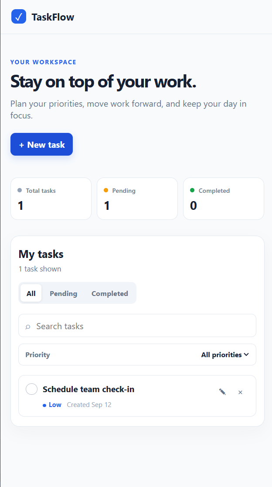

# TaskFlow

TaskFlow is a responsive task management dashboard built with React and TypeScript, focused on clean UX, accessibility and local-first persistence.

## Preview



## Live Demo

https://emioj89.github.io/react-task-dashboard/

## Features

- Create tasks
- Edit tasks
- Delete tasks
- Mark tasks as pending/completed
- Low / Medium / High priorities
- Search
- Status filtering
- Priority filtering
- Task statistics
- localStorage persistence
- Responsive layout
- Accessible modal
- Keyboard navigation
- Safe localStorage validation
- Empty states

## Tech Stack

- React
- TypeScript
- Vite
- Oxlint
- CSS
- LocalStorage API

## Architecture

```
src/
  components/  # UI components and accessible modals
  data/        # Default initial data and seeds
  hooks/       # Custom React hooks (e.g. task management & persistence)
  types/       # TypeScript type definitions and interfaces
```

## Accessibility

- Visible keyboard focus
- Accessible modal
- Escape to close
- Focus trapping
- ARIA labels
- Touch-friendly controls

## Getting Started

```bash
git clone https://github.com/emioj89/react-task-dashboard.git
cd react-task-dashboard
npm install
npm run dev
```

## Production Build

```bash
npm run build
```

## Quality Checks

```bash
npm run lint
```

## Project Status

MVP completed.

This project is part of the professional portfolio of Emiliano Ostellino.

## Author

Emiliano Ostellino

GitHub: https://github.com/emioj89
